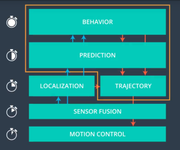

#CarND-Path-Planning-Project
Self-Driving Car Engineer Nanodegree Program

##Path Planning with Self-driving Car

The actual implementation of the decision and trajectory generation can be very different from situation to situation. Parking lot or urban street driving is very different from highway environment. In this work a simple highway path planner implementation.

The path planner is located at the top of the software stack for self-driving cars. When the vehicle knows where to go, the route planner looks at how the vehicle reaches its goal.
In general, path planners have three subcomponents: prediction, behaviour planner and trajectory generator. The predictive components receive input from Localization(ego vehicle position data) and sensor fusion (ambient position data, vehicles, obstacles, etc.). The expected set of trajectories for the object as a result of the prediction. Based on these predictions, paths, and vehicle conditions, the action module determines what can be done next. Finally, the trajectory generator creates a propellable trajectory that must satisfy the decision.

##Goal of this project
The goal of this project is to safely explore virtual highways with other traffic volumes driving +-10 MPH with a 50 MPH speed limit. Vehicle positioning and sensor fusion data are provided, and there is a sparse list of waypoints around the highway. It should be noted that cars should try to get as close to the 50 mph speed limit as possible, which means slower traffic when possible, and other cars will also try to change lanes. In addition to avoiding collisions with other lanes, the vehicle must always be driven in marked road lanes unless it moves from one lane to another. The car will be able to completely circle the 6946m highway. As the vehicle is about to drive 50 mph, it will take a little more than 5 minutes to complete one circuit. Also, you cannot experience zerks larger than 10m/s^2 and 10m/s^3.

###Map
The map of the highway is data/highway_map.txt
Each waypoint in the list contains a value of [x,y,s,dx,dy]. x and y are the map coordinate positions of the waypoints, the s values are the distance on the road to reach the waypoints in meters, and the dx and dy values define the unit normal vectors pointing outside the highway loop.

Due to the circulation of the highway's waypoints, the railing distance along the road ranges from 0 to 6945.554.

##Dependencies
***
1. cmake >= 3.5
2. make >= 4.1
3. gcc/g++ >= 5.4
4. uWebSockets
***
## Build
***
1. mkdir build
2. cd build
3. cmake ..
4. make
5. ./path_planning
***
##Traffic Analysis
Once trajectories can be generated along the road, the next challenge is to avoid collisions with other vehicles and, if possible, generate and pass trajectories.

A list of sensor Fusion objects is provided with the following data:

Unique identification of the car,
the x-position of the car in the coordinates of the map,
Locate the car in the coordinates of the map.
the x-speed (in m/s) of the vehicle;
The y-speed of the car (in m/s)
We're going to tie the positions of the cars into coordinates.
The coordinates of the position of the car.
###line [132 to 151]
To prevent rear-end collisions, check all vehicles in the sensor fusion to ensure they are in the same lane as the ego car. If the slower front car is identified, the slower front car than the self car should match the speed of the car.
###line [155 to 184]
Evaluate the possibility of lane change if the ego car is driving behind a slower vehicle. For example, in the case of a left-hand lane change, there should be a vehicle driving interval on the left-hand lane, at least twice the vehicle safety distance and at least half the rear safety distance. This gap can be checked to ensure that the ego car does not collide side by side with another vehicle travelling side by side and is not cut too short in front of the other vehicle.
###line [187 to 211]
Lane change decisions are made when driving behind a slow vehicle has room to change lanes to the left or right lane, and vehicles in the destination lane are moving faster. There is no need to follow low-speed vehicles in other lanes.
***
##Path Planning

###line [276 to 284]
The route is computed as a sequence of (x, y) points in the map coordinate system that the ego car will visit one by one. The vehicle's speed is determined by the spacing between the (x, y) points, taking into account that every 20 ms cycle the car moves to the next available point in the sequence.

Vehicle speed is controlled in units of max_accel * delta_time so that the speed changes smoothly from one cycle to another. The reference speed is the desired speed. It is set at 50 MPH every cycle, unless the ego car matches the speed of the vehicle in front.
###line [251 to 259]
It can be processed to calculate the order of the points going down the road in the middle of the selected lane, or to lay out a route for a lane change.

This sequence takes into account the previous and current position of the ego vehicle, then three more points. The next point is 35 meters away along the road's coordinates. The d coordinate is also set to be in the center of the desired lane. The function getXY() converts the given Frenet point to Cartesian coordinates.
###line [262 to 271]
The trajectory should be smooth because the sudden change in the path causes unwanted jerks. If the vehicle is following the correct point above, lane change means a direct jump from the adjacent lane with infinite acceleration. To prevent this, interpolation is performed that can be changed gradually during the creation of the midpoint.

Cubic spline interpolation is a good way to create a quadratic polynomial trajectory through each point.spline.h used in this open source library.

The map points are converted to vehicle coordinates and splines are installed at these points. Converting to vehicle coordinates is especially useful when the road is straight north and multiple y-values correspond to the same x. It is also easier if the vehicle goes southwest and the x value decreases. This is because you do not need to sort the x value by x. The conversion takes place through conversion and rotation.
###line [287 to 303]
Splines are used to create trajectory points. The distance ahead increases with the driving speed. x increases directly because it follows the driving direction. y is calculated using the spine function. The points are converted back to map coordinates and represent the future trajectory of the ego car.
***
##Result

 
  
***
##How to write a README
***
A well written README file can enhance your project and portfolio. Develop your abilities to create professional README files by completing this free course.